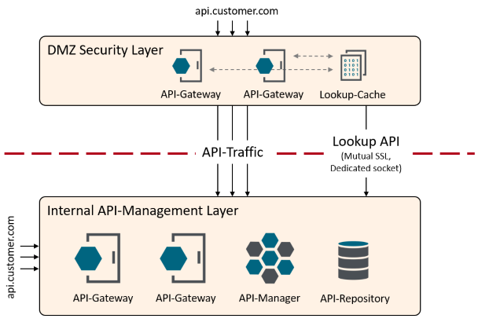

# API Exposure check policy

If you are using the API-Management solution primarily for an API-centric architecture, then it makes sense to place the API management solution on the internal network. 
Nevertheless, there is very often the requirement that some of the APIs must be made securely available on the Internet as a public API. 
For this you can build an API security layer based on API gateways. This layer is the edge defense for all incoming Internet API traffic.
The following architecture represents this concept.



API gateways without API management are located in the security layer. As a result, there is no context in this layer for security policies executed there to make decisions based on individual APIs. Thus, it is not readily possible for the security layer to decide whether a private API should be publicly exposed.

The set of policies provided here represents one possible solution. The internal API management layer exposes a lookup API via a dedicated extra secured port. This API gives context to the security layer, which is necessary for the decision. 
For example, you can configure an API with a custom-property "Public API" and query it in the security layer.


You can do the same with any other Frontend-API property. So, for example, based on Tags, Security, State, etc.

:point_right: Consider all provided policies as templates which should help to implement the solution presented here. Most likely, you will still need to customize the policies to your requirements, which is the intention. For example, perform the exposure check based on additional properties or do not cache the entire API proxy in the security layer.

# Internal API-Management layer

A description of [policies](/src/api-management-layer-policies.xml) that are supposed to run on the internal API-Management platform.

## API-Proxy cache policy

The information about registered APIs is not retrieved directly from the API Manager REST API, but cached in advance. This policy is started via a scheduler, reads the registered APIs (Frontend APIs) from the API Manager and stores them in a cache.

Policy-Name: `Lookup API/Cache exposed API-Proxies`


The Javascript code adding API-Proxies to the cache
```js
var net = Packages.net;
var javaImp = new JavaImporter(net.sf.ehcache, com.vordel.trace, com.vordel.circuit.cache);

with(javaImp){

function invoke(msg) {
  
  var apiProxies = msg.get("content.body").getJSON();
  var apicache = CacheContainer.getInstance().getCache("API-Proxies");

  Trace.debug("API-Proxies already cached: " + apicache.getKeys());

  // Remove previosly cached APIs
  apicache.removeAll();
  for (i = 0; i < apiProxies.size(); i++) {
    var apiProxy = apiProxies.get(i);
    var path = apiProxy.get("path").asText();
    var apiRoutingKey = apiProxy.get("apiRoutingKey").asText();
    var vhost = apiProxy.get("vhost").asText();
    var key = path + "###" + apiRoutingKey + "###" + vhost;
    Trace.info("Using key: "+key+" to cache API: " + apiProxy.get('name') + " version: " +apiProxy.get('version')+ " (Id: "+apiProxy.get('id')+")");
    Trace.info("apiProxy: "+ apiProxy + " Class name: " + apiProxy.getClass().getName());
    apicache.put(new net.sf.ehcache.Element(key, apiProxy));
  }
  Trace.info(apicache.getKeys());
    
  return true;
}

};
```

## API-Exposure policy

This policy is used to implement the lookup API for the security layer. To do this, this policy accesses the pre-cached API proxy information. Determines the correct API proxy based on the parameters: apiPath (host and apiRoutingKey prepared but not implemented) and returns it.
Bind this policy to an HTTPS listen socket of your choice and set it to two-way SSL if necessary.

Policy-Name: `Lookup API/Cache exposed API-Proxies`


The Javascript code looking up the correct API based on the previously created cache.

```js
var javaImp = new JavaImporter(com.vordel.trace, com.vordel.circuit.cache);

with(javaImp){
  function invoke(msg) {
    var apicache = CacheContainer.getInstance().getCache("API-Proxies");
    var cacheKeys = apicache.getKeys();

    Trace.debug(cacheKeys.size() + " API-Proxies found in cache.");
  
    var apiPath = msg.get("params.query.apiPath");
    Trace.debug("apiPath=" + path);

    // Split the given request path to find the closest match
    var pathSplits = apiPath.split("/");

    var result = false;
    var current = "";

    for (i=1; i<pathSplits.length; i++) {
      current = current + "/" + pathSplits[i];
      var key = current + "###null###null";
      var position = cacheKeys.indexOf(key);
    
      if (position > -1) {
        Trace.info("API found for key: " + key);
        msg.put("lookup.apiProxy", apicache.get(key).getObjectValue());
        result = true;
        break;
      } else {
        Trace.debug("No API found for key: " + key);
      }
    }
    return result;
  }
};
```

# Security API-Gateway layer

A description of [policies](/src/security-layer-policies.xml) that are supposed to run on the API-Gateway security layer.

## Check exposed API policy

This policy uses the information provided via the Lookup API to make a decision on whether or not to allow the request to pass.
To avoid a lookup for each API request, the information is cached. In addition, unknown APIs are also cached to avoid brute force attacks on the lookup API.

Policy-Name: `Lookup API/Check exposed API`


## API Management Version Compatibilty
This artefact was successfully tested for the following versions:
- 7.7.20200730 (or higher / has been exported from that version, hence it cannot be imported into earlier versions)

## Bug and Caveats
- VHost and API-RoutingKey is not implemented

## Contributing

Please read [Contributing.md](https://github.com/Axway-API-Management-Plus/Common/blob/master/Contributing.md) for details on our code of conduct, and the process for submitting pull requests to us.

## Team

![alt text][Axwaylogo] Axway Team

[Axwaylogo]: https://github.com/Axway-API-Management/Common/blob/master/img/AxwayLogoSmall.png  "Axway logo"

## License
[Apache License 2.0](LICENSE)
